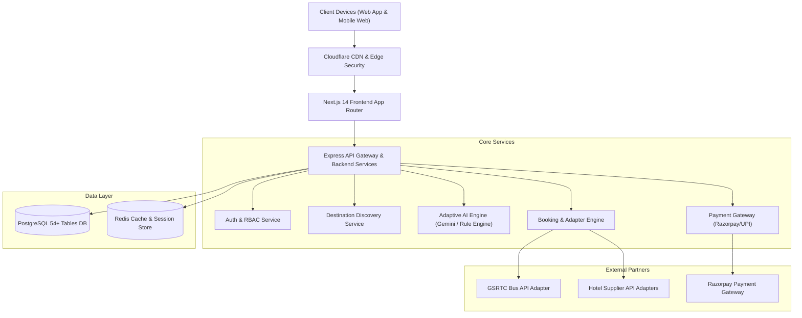

# High-Level System Architecture — Chalo Farva v1.0

## 1. System Vision & Architecture Overview
Chalo Farva is designed as an event-driven, microservices-ready modular monolith powered by Next.js 14 on the frontend and Express/Node.js + PostgreSQL on the backend.

## 2. Core Operational Loop
1. **Discover**: Traveler explores 24+ curated Gujarat destinations enriched with verified metadata and live ratings.
2. **Plan with AI**: Traveler inputs preferences into the 5-step wizard. AI Engine generates a complete multi-day itinerary.
3. **Book**: Traveler books buses (GSRTC), hotels, and packages in one seamless checkout.
4. **Organize**: Itineraries and ticket vouchers rendered in real-time on desktop and mobile.
5. **Monitor & Adapt**: System monitors weather advisories and closures, deterministically re-routing plans if disruptions occur.
6. **Enjoy**: Traveler experiences Gujarat with zero coordination friction.
