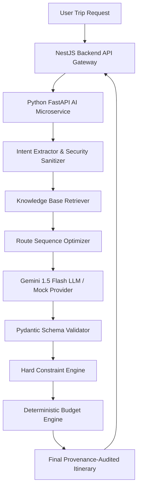

# Chalo Farva AI Trip Planner Architecture v1.0

## 1. Overview
The Chalo Farva AI Trip Planner v1.0 is a hybrid microservice architecture combining LLM natural language understanding with deterministic validation engines, verified travel knowledge bases, and financial budget rules.

## 2. Architectural Principle
> **LLM is NOT the source of truth.**
> Core Stack: `LLM + Verified Knowledge Base + Live Provider Data + Maps + Weather + Deterministic Rules + Optimization Engine`

## 3. Core Components
1. **Intent Extractor (`pipeline/intent_extractor.py`)**: Sanitizes prompt injection and parses user constraints.
2. **Knowledge Base Retriever (`knowledge/retriever.py`)**: Grounding with `08_TRAVEL_DATA/Knowledge_Base/normalized_facts.json`.
3. **Route Optimizer (`optimization/route_optimizer.py`)**: Distance matrix & sequence optimization (`A -> B -> C`).
4. **Hard Constraint Engine (`constraints/hard_constraint_engine.py`)**: Validates opening hours, closed days (Mondays), and monsoon closures (Gir Park June 16 - Oct 15).
5. **Budget Engine (`pipeline/budget_engine.py`)**: Deterministic calculations for transport, food, activities, and lodging. Zero LLM math.
