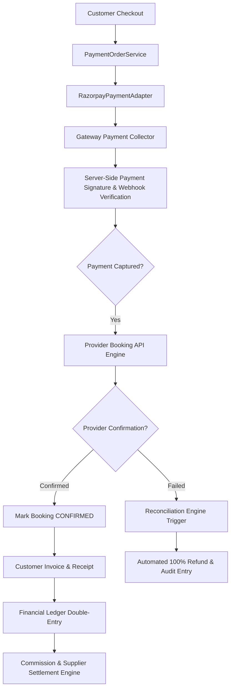

# Chalo Farva Payments & Financial Infrastructure Architecture v1.0

## 1. Overview
Production-ready financial infrastructure separating Payment Orders, Payment Gateway Adapters, Booking Engine, Customer Invoicing, Deterministic Refunds, Marketplace Commercials, Balanced Double-Entry Accounting Ledger, Supplier Settlements, and 4-Way Reconciliation.

## 2. Core Architecture Pipeline

## 3. Core Principles
- **Payment and Booking are Separate State Machines**: `Payment SUCCESS != Booking CONFIRMED`.
- **Zero Raw Card / CVV Storage**: Tokenized hosted payment gateways only.
- **Double-Entry Immutable Accounting**: Balanced debits and credits across all 8 ledger accounts.
