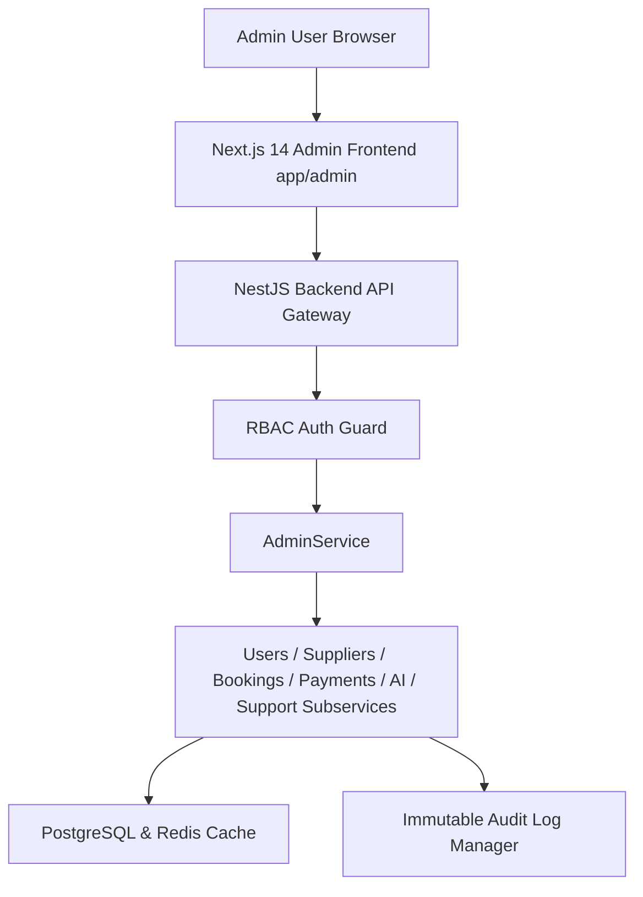

# Chalo Farva Admin Panel Architecture v1.0

## 1. Overview
The Admin Panel is Chalo Farva's internal operational console for marketplace governance, user administration, supplier verification, inventory approval, payment/refund oversight, double-entry ledger monitoring, AI adaptation monitoring, and support ticket resolution.

## 2. Core Architecture Pipeline

## 3. Core Principles
- **Server-Side Authorization**: Every protected API validates user identity, role, and granular permission. Frontend route hiding alone is never trusted.
- **Audit Traceability**: Sensitive administrative state changes (supplier approvals, account suspensions, refund interventions) create an audit record.
